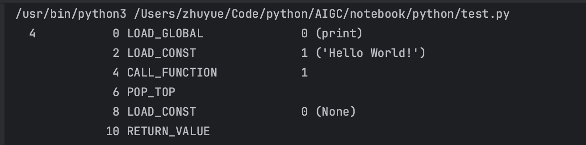

#### Python解释器及运行相关流程

Python程序的执行流程：

- **源代码**：首先，你编写Python程序的源代码文件，通常使用`.py`作为文件扩展名。这个源代码文件包含了你的Python代码。

- **词法分析和语法分析**：当你运行Python程序时，Python解释器首先执行词法分析和语法分析。这些步骤将源代码分解为标记（tokens）并构建一个抽象语法树（AST）。

- **字节码生成**：接下来，Python解释器将AST转换为字节码。字节码是一种中间表示形式，用于描述Python代码的低级别指令集。

  - Python中的字节码是一种中间的表示形式，Python中的字节码（bytecode）是一种中间表示形式，用于描述Python代码的低级别、抽象的指令集。当你编写Python代码并运行它时，Python解释器首先将源代码编译为字节码，然后由Python的虚拟机（Python Virtual Machine, PVM）来执行这些字节码。

  - 字节码是介于源代码和机器码之间的中间代码。它不同于机器码，机器码是直接在特定类型的硬件上运行的。相反，字节码是为Python虚拟机设计的，可以在任何平台上解释和执行，只要该平台上有合适的解释器。

  - 使用dis.dis可以查看对应代码的生成的字节码：

    ```python
    from dis import dis
    
    def test():
      print("Hello World")
      
    print(dis.dis(test))
    ```

    
    
  - 当Python代码被编译时，除了产生字节码，还会产生其他关于这段代码的元数据，例如常量表、变量名、行号信息等。这些元数据与字节码一同被封装成一个称为代码对象的结构。代码对象是Python的内置类型，可以通过Python的`types`模块的`CodeType`查看。

  - Python的字节码（bytecode）是Python源代码经过编译后得到的中间代码，用于描述Python代码的低级别、抽象的指令集。这些字节码指令不是为任何特定的硬件架构设计的机器码，而是为Python虚拟机（PVM，Python Virtual Machine）设计的。Python解释器会进一步解释和执行这些字节码，从而实现Python代码的运行。

    Python源代码（通常是`.py`文件）在执行前首先会被编译为字节码，然后存储在`.pyc`文件中，这些`.pyc`文件位于`__pycache__`目录下。

- **字节码执行**：CPython虚拟机（PVM，Python Virtual Machine）会解释和执行生成的字节码。PVM遵循字节码的指令序列，执行相应的操作，例如变量分配、函数调用、运算等。字节码随后被PVM解释和执行。PVM是CPython中负责这一任务的组件。它通过一个主循环遍历字节码，为每个字节码指令找到对应的C函数或代码块，并执行它。

- **模块导入**：在执行过程中，如果你的程序包含`import`语句，Python会在需要时导入其他模块或库，执行这些模块中的代码。

- **执行流程**：程序的执行流程通常从文件的入口点开始，例如从主程序的顶层代码或从一个特定的函数。程序按照顺序执行，逐行或逐指令运行代码，遇到控制结构（如条件语句和循环）时，根据条件执行不同的分支或重复执行一组指令。

- **结束**：当程序执行完所有代码或者遇到`sys.exit()`等程序终止指令时，程序结束执行。此时，程序可能会返回一个退出代码，以指示程序的成功或失败。
